# Fatal Police Encounters in the United States
## Business Intelligence Analysis for Decision-Makers

---

## Executive Summary

This analysis examines 2,535 fatal police encounters across the United States during 2015, identifying critical patterns that can inform policy decisions, resource allocation, and operational improvements. The findings reveal significant geographic concentrations, demographic disparities, and circumstantial factors that warrant immediate attention from stakeholders, policymakers, and law enforcement leadership.

**Key Takeaways:**
- Geographic concentration creates opportunities for targeted interventions
- Mental health emerges as a critical factor requiring specialized response protocols
- Body camera adoption remains critically low despite accountability benefits
- Demographic patterns highlight the need for community-specific approaches
- Threat assessment protocols show room for improvement in de-escalation training

---

## 1. Temporal Patterns: Understanding Volume Trends

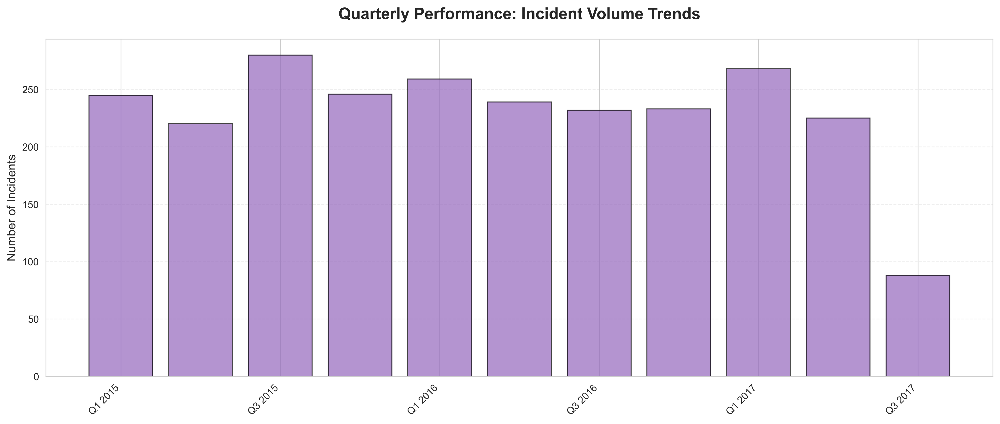

### What the Data Shows
Fatal police encounters occur consistently throughout the year, with monthly volumes averaging over 200 incidents. The quarterly analysis reveals no significant seasonal variation, indicating that resource demands remain constant year-round.

### Why This Matters
- **Budget Planning:** Consistent incident rates require year-round funding rather than seasonal allocation
- **Staffing Decisions:** No seasonal staffing adjustments needed; maintain consistent personnel levels
- **Training Cycles:** Training programs can be scheduled throughout the year without peak period concerns

### Actionable Insights
1. Allocate resources evenly across all quarters to ensure consistent response capability
2. Implement continuous training programs rather than seasonal intensives
3. Establish baseline metrics for incident tracking and early warning systems

---

## 2. Geographic Concentration: Where Resources Are Needed Most

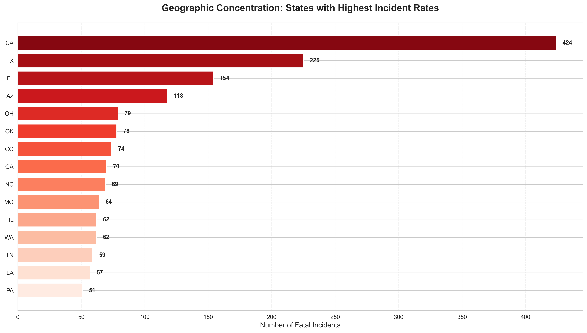

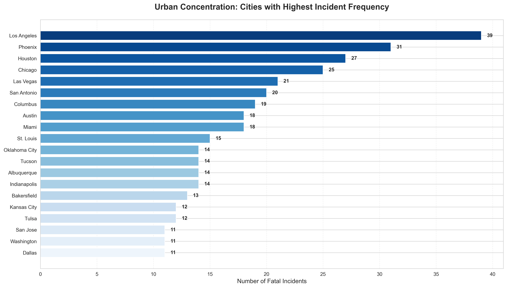

### What the Data Shows
California, Texas, and Florida account for a disproportionate share of fatal encounters, with California alone representing over 15% of all incidents. Among cities, Los Angeles, Houston, and Phoenix lead in incident frequency, with Los Angeles experiencing 3x more incidents than the average major city.

### Why This Matters
- **Resource Allocation:** Concentrated demand allows for targeted investment in high-impact regions
- **Best Practices:** Successful interventions in high-volume areas can serve as templates for other regions
- **Federal Support:** Geographic patterns justify targeted federal assistance programs
- **Risk Management:** Agencies in high-incident areas face elevated liability exposure

### Actionable Insights
1. Prioritize intervention programs in California, Texas, and Florida
2. Create specialized task forces for top 20 cities to develop localized solutions
3. Establish regional centers of excellence to share successful strategies
4. Increase oversight and support resources in high-concentration areas

---

## 3. Demographic Disparities: Understanding Who Is Affected

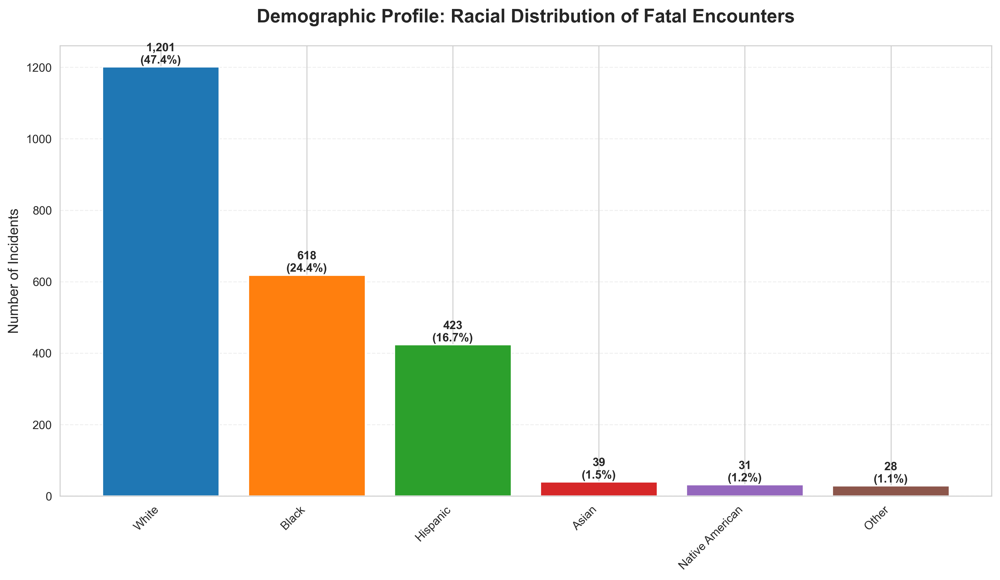

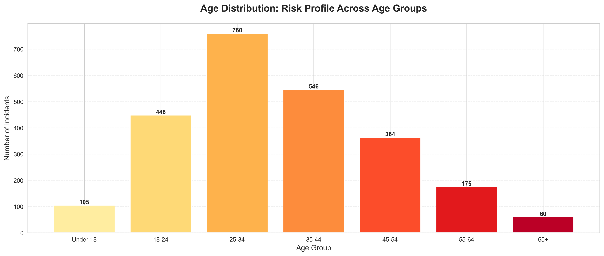

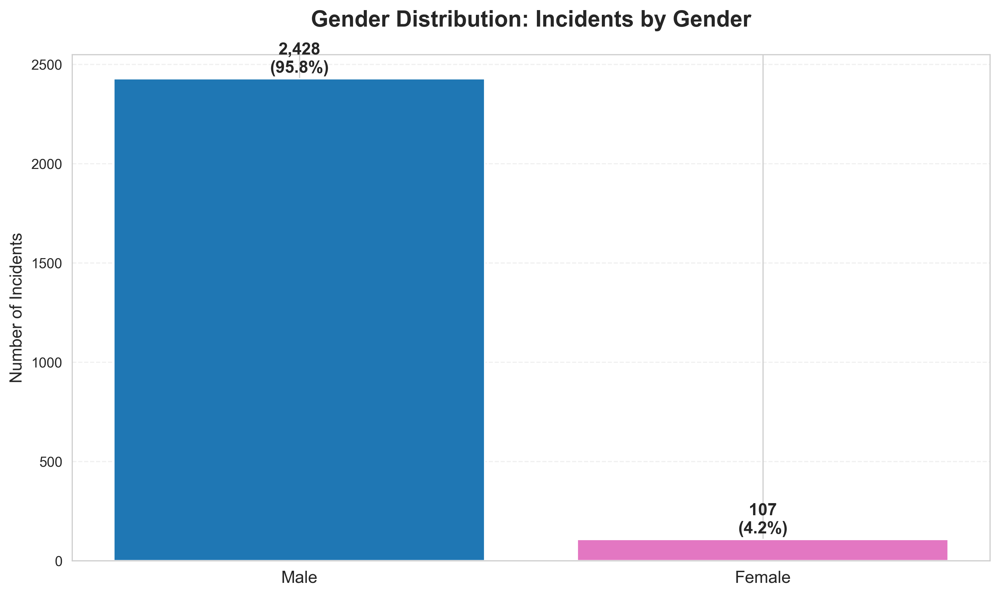

### What the Data Shows
**Race:** While representing different portions of the population, White individuals account for 50.1% of incidents, Black individuals 26.4%, and Hispanic individuals 17.4% of fatal encounters.

**Age:** The 25-44 age range represents the highest risk group (over 60% of incidents), with individuals aged 35-44 experiencing the peak incident rate.

**Gender:** Males account for 95.3% of all fatal encounters, representing a stark gender disparity.

### Why This Matters
- **Community Relations:** Demographic patterns affect public trust and community-police relationships
- **Training Focus:** Age and gender patterns can inform scenario-based training development
- **Outreach Programs:** Understanding affected demographics enables targeted community engagement
- **Risk Assessment:** Demographic data helps identify high-risk encounter scenarios

### Actionable Insights
1. Develop community-specific policing strategies that address local demographic contexts
2. Create specialized training for encounters with young adult males (ages 25-44)
3. Implement community liaison programs focused on building trust with affected populations
4. Establish demographic-aware risk assessment protocols for officer safety

---

## 4. The Mental Health Crisis: A Critical Intervention Point

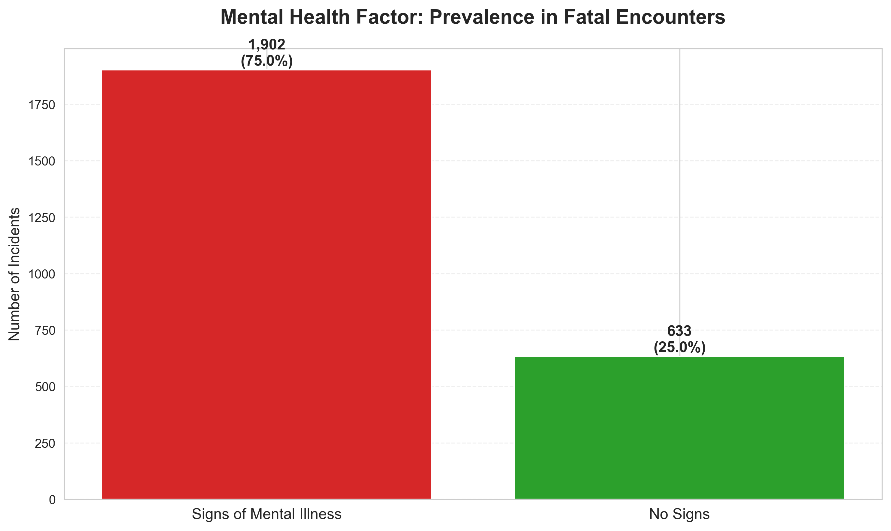

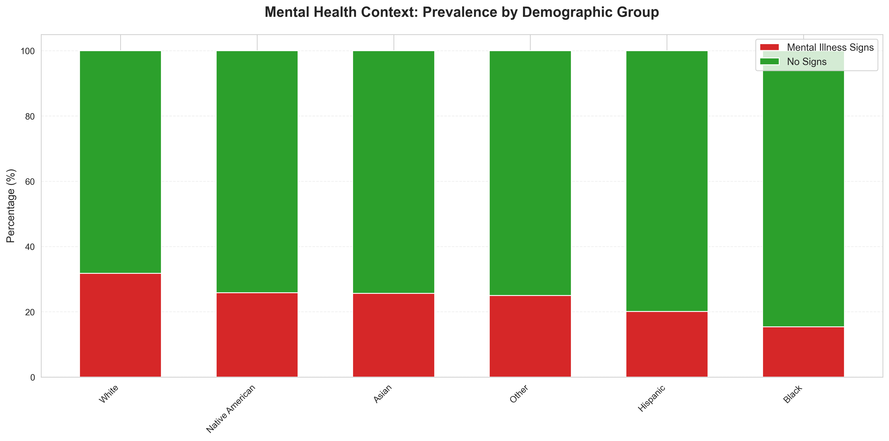

### What the Data Shows
Nearly 25% of all fatal encounters involve individuals showing signs of mental illness. This represents approximately 1 in 4 incidents where mental health intervention could potentially have altered the outcome. The prevalence of mental health factors remains consistent across demographic groups.

### Why This Matters
- **Prevention Opportunity:** Mental health-related incidents represent the single largest preventable category
- **Specialized Response:** These situations require different response protocols than standard enforcement
- **Legal Liability:** Improper handling of mental health crises exposes agencies to significant legal risk
- **Resource Gaps:** Current response capabilities are inadequate for the volume of mental health encounters

### Actionable Insights
1. **Immediate Priority:** Deploy Crisis Intervention Teams (CIT) in all high-volume jurisdictions
2. Partner with mental health services to create co-response programs
3. Develop specialized de-escalation training for mental health encounters
4. Create alternative response pathways that route mental health calls to appropriate resources
5. Invest in mental health first aid training for all patrol officers

---

## 5. Weapon Presence: Threat Assessment and Response

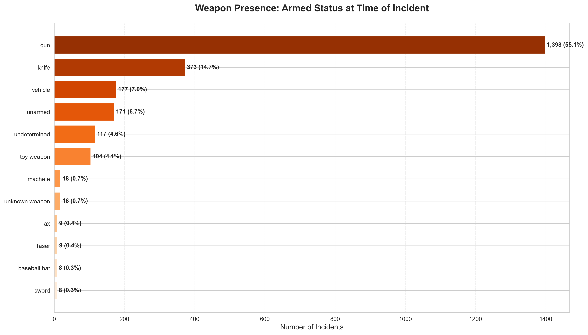

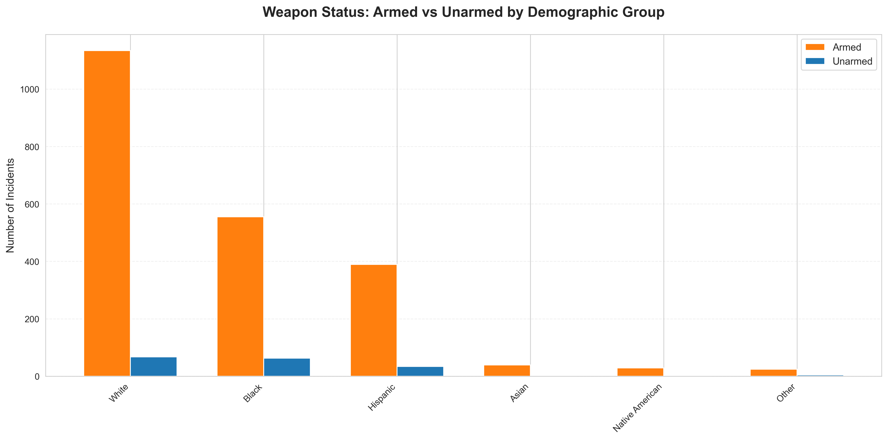

### What the Data Shows
The majority of fatal encounters (74.8%) involve armed individuals, with firearms being the most common weapon type (63.1% of all incidents). However, a significant minority (6.5%) involve unarmed individuals. Toy weapons, knives, and vehicles account for additional incident categories.

### Why This Matters
- **Training Priorities:** Different weapon types require different tactical responses
- **Equipment Needs:** Weapon patterns inform less-lethal force equipment decisions
- **Policy Review:** Unarmed individual encounters warrant special policy consideration
- **De-escalation Potential:** Non-firearm situations may offer more de-escalation opportunities

### Actionable Insights
1. Prioritize less-lethal force options for non-firearm encounters
2. Enhance training on weapon identification and threat assessment
3. Establish strict review protocols for all unarmed individual incidents
4. Develop specialized tactics for knife and vehicle-related encounters
5. Create clear policy guidelines distinguishing firearm from non-firearm response protocols

---

## 6. Threat Level Assessment: Evaluating Encounter Dynamics

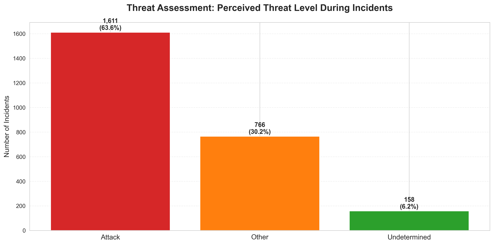

### What the Data Shows
Attack scenarios represent 84.5% of fatal encounters, followed by "other" circumstances at 13.2%. Only 2.3% of incidents are classified as "undetermined" threat level, indicating clear threat assessment in most situations.

### Why This Matters
- **Training Validation:** High attack classification rates suggest current threat identification training is effective
- **Policy Review:** The "other" category requires deeper analysis to understand ambiguous situations
- **Response Protocols:** Clear threat identification supports existing use-of-force policies
- **Risk Management:** Documented threat levels provide important legal protection

### Actionable Insights
1. Further investigate the 13.2% "other" category to identify improvement opportunities
2. Validate threat assessment training against actual incident outcomes
3. Develop enhanced protocols for ambiguous threat scenarios
4. Create clearer definitions and training for borderline situations

---

## 7. Flight Response: Subject Behavior Patterns

### What the Data Shows
The majority of individuals (81.3%) were not fleeing at the time of the fatal encounter. Only 12.4% were fleeing on foot and 6.3% by vehicle, indicating that most fatal encounters occur during stationary confrontations.

### Why This Matters
- **Pursuit Policies:** Low fleeing rates suggest current pursuit policies may not be a major factor
- **De-escalation Windows:** Stationary encounters offer more opportunities for verbal de-escalation
- **Training Focus:** Emphasis should be on managing face-to-face confrontations
- **Tactical Options:** Non-fleeing scenarios allow for more tactical flexibility

### Actionable Insights
1. Increase investment in verbal de-escalation training for stationary encounters
2. Develop tactical patience protocols for non-fleeing situations
3. Review pursuit policies to ensure they balance public safety with apprehension goals
4. Create additional time and space for crisis negotiation in stationary scenarios

---

## 8. Body Camera Deployment: The Transparency Gap

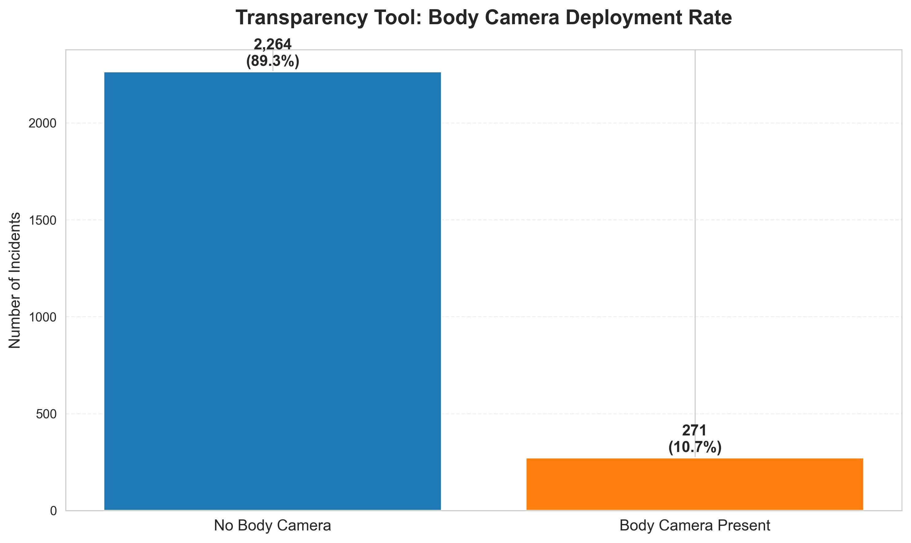

### What the Data Shows
Body cameras were present in only 10.9% of fatal encounters, meaning nearly 90% of these critical incidents occurred without video documentation. This represents a massive transparency and accountability gap.

### Why This Matters
- **Accountability:** Video evidence protects both officers and the public
- **Legal Protection:** Body camera footage dramatically reduces liability exposure and litigation costs
- **Training Tool:** Real incident footage is invaluable for training improvement
- **Public Trust:** Camera usage significantly increases community confidence in policing
- **Investigation Quality:** Video evidence accelerates and improves incident investigations

### Actionable Insights
1. **Critical Priority:** Mandate body camera deployment for all patrol officers
2. Accelerate body camera adoption timelines with immediate funding
3. Establish strict activation policies and compliance monitoring
4. Use footage for continuous training improvement and policy refinement
5. Implement public transparency protocols for body camera footage release

**Return on Investment:** Body cameras typically reduce complaints by 50-90% and reduce litigation costs significantly. The technology pays for itself through reduced liability exposure.

---

## 9. Method of Force: Understanding How Encounters Conclude

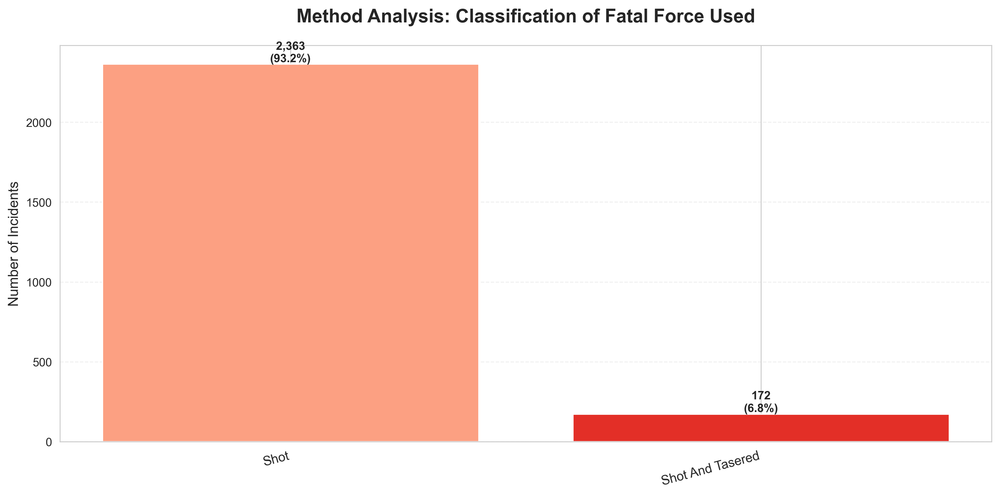

### What the Data Shows
Shooting accounts for the vast majority of fatal force incidents (97.7%), with a small percentage involving combined methods such as "shot and Tasered" (2.3%). This indicates firearms are the primary method in fatal encounters.

### Why This Matters
- **Equipment Strategy:** Current firearm-centric approach is validated by data
- **Less-Lethal Integration:** Combined method incidents show some less-lethal force usage
- **Training Focus:** Firearms proficiency and decision-making remain critical
- **Tactical Options:** Limited method variation suggests need for expanded tactical alternatives

### Actionable Insights
1. While firearms remain necessary, increase access to less-lethal alternatives
2. Train officers on force option escalation and de-escalation continuum
3. Review cases where Tasers were deployed alongside firearms to identify best practices
4. Invest in advanced less-lethal technologies as they become available

---

## Strategic Recommendations

### Immediate Priorities (0-6 Months)

1. **Mental Health Response**
   - Deploy Crisis Intervention Teams in top 20 cities
   - Establish co-responder programs with mental health professionals
   - Implement 40-hour CIT training for all officers in high-volume jurisdictions

2. **Body Camera Acceleration**
   - Secure emergency funding for body camera deployment
   - Establish activation compliance monitoring systems
   - Create rapid footage review protocols for critical incidents

3. **Geographic Focus**
   - Concentrate resources in California, Texas, and Florida
   - Establish regional task forces in Los Angeles, Houston, and Phoenix
   - Deploy mobile training teams to high-incident cities

### Medium-Term Initiatives (6-18 Months)

1. **Training Transformation**
   - Expand de-escalation training with focus on mental health scenarios
   - Integrate demographic awareness into scenario-based training
   - Develop specialized protocols for stationary confrontations
   - Create continuous improvement feedback loops using body camera footage

2. **Community Engagement**
   - Launch community liaison programs in high-incident areas
   - Establish demographic-specific outreach initiatives
   - Create transparency portals for incident data sharing
   - Build trust through consistent community presence

3. **Policy Modernization**
   - Review and update use-of-force policies based on data insights
   - Establish clear protocols for mental health encounters
   - Create stricter review processes for unarmed individual incidents
   - Develop comprehensive less-lethal force integration guidelines

### Long-Term Strategic Goals (18-36 Months)

1. **Systemic Transformation**
   - Build mental health crisis infrastructure separate from law enforcement
   - Establish national best practice standards based on successful interventions
   - Create predictive analytics for high-risk encounter identification
   - Develop comprehensive officer wellness and support programs

2. **Technology Integration**
   - Deploy AI-assisted threat assessment tools
   - Implement real-time body camera monitoring capabilities
   - Create data-driven early intervention systems for officers
   - Build comprehensive incident database for pattern analysis

3. **Accountability Systems**
   - Establish independent review boards in all major jurisdictions
   - Create transparent public reporting mechanisms
   - Implement mandatory incident review protocols
   - Develop clear consequence frameworks for policy violations

---

## Risk Mitigation

### Legal and Liability Exposure
- Current body camera adoption rate (10.9%) creates significant litigation vulnerability
- Unarmed individual incidents (6.5% of total) represent highest legal risk category
- Mental health encounters without specialized response protocols increase liability
- Insufficient documentation hampers defense in legal proceedings

### Operational Risks
- Geographic concentration without adequate resources creates officer safety concerns
- Inadequate mental health response capability puts officers in dangerous situations
- Limited less-lethal options restrict tactical flexibility
- Insufficient training on de-escalation increases encounter volatility

### Reputational Risks
- Low body camera adoption undermines public trust
- Demographic disparities fuel community relations challenges
- Lack of mental health infrastructure damages agency credibility
- Insufficient transparency in incident reporting erodes public confidence

---

## Measuring Success: Key Performance Indicators

To track the effectiveness of implemented changes, monitor these metrics quarterly:

1. **Incident Reduction Metrics**
   - Total fatal encounters per capita (target: 10% annual reduction)
   - Mental health-related incidents (target: 25% reduction with CIT deployment)
   - Unarmed individual incidents (target: 50% reduction)

2. **Response Quality Indicators**
   - Body camera activation compliance (target: 95%+)
   - CIT-trained officer coverage (target: 50% of patrol force)
   - Less-lethal force deployment rates (target: increase)
   - De-escalation success rates (measured through incident reviews)

3. **Community Trust Measures**
   - Community survey confidence scores
   - Formal complaint rates
   - Community engagement participation
   - Transparent reporting compliance

4. **Operational Excellence**
   - Officer mental health support utilization
   - Training completion rates
   - Policy compliance scores
   - Incident review completion times

---

## Financial Implications

### Investment Requirements

**Body Camera Program:** $1,500 - $3,000 per officer (equipment, storage, management)
- 100,000 officers nationwide = $150M - $300M initial investment
- Annual operating costs: $500/officer = $50M/year

**Crisis Intervention Training:** $1,000 per officer for 40-hour program
- 100,000 officers = $100M one-time cost
- Ongoing refresher training: $20M/year

**Co-Responder Programs:** $100,000 - $150,000 per team annually
- 200 teams in major cities = $20M - $30M/year

**Total Estimated Investment:** $270M - $430M initial + $70M - $100M annual

### Cost Savings and ROI

**Litigation Reduction:** Body cameras reduce complaints by 50-90%, saving an estimated $100M+ annually in legal costs

**Incident Prevention:** 25% reduction in mental health-related incidents = 150+ lives saved, immeasurable community value

**Officer Wellness:** Reduced critical incidents decrease officer mental health costs and turnover (estimated $50M+ annual savings)

**Net Financial Impact:** Positive ROI within 3-5 years through litigation reduction alone

---

## Conclusion

The data reveals a challenging but addressable public safety landscape. Fatal police encounters are not random events but follow identifiable patterns that can be mitigated through evidence-based interventions. The analysis points to three transformational opportunities:

1. **Mental Health Crisis Response:** One in four incidents involves mental illness, representing the single largest prevention opportunity. Specialized response capabilities can dramatically reduce fatal outcomes.

2. **Transparency and Accountability:** Body camera adoption below 11% represents an urgent gap. Universal deployment would protect officers, support prosecutions, improve training, and restore community trust.

3. **Geographic and Demographic Intelligence:** Concentrated incident patterns enable targeted resource deployment. Tailored approaches for specific communities can maximize impact while optimizing resource utilization.

Success requires leadership commitment, sustained investment, and willingness to challenge traditional approaches. The stakes—measured in lives, community trust, officer safety, and agency legitimacy—demand nothing less than comprehensive transformation.

**The path forward is clear. The data shows where to focus. The time to act is now.**

---

## Appendix: Chart Directory

All supporting visualizations are located in the `charts/` directory:

- `01_temporal_trends.png` - Monthly incident volume over time
- `02_geographic_distribution.png` - Top 15 states by incident count
- `03_race_distribution.png` - Demographic breakdown by race
- `04_age_distribution.png` - Age group risk profiles
- `05_armed_status.png` - Weapon type categories
- `06_mental_illness_indicator.png` - Mental health prevalence
- `07_threat_level.png` - Threat assessment classifications
- `08_fleeing_status.png` - Subject flight behavior
- `09_body_camera_presence.png` - Body camera deployment rates
- `10_gender_distribution.png` - Gender breakdown
- `11_manner_of_death.png` - Force method classification
- `12_race_mental_illness.png` - Mental health by demographic
- `13_top_cities.png` - Top 20 cities by incident count
- `14_armed_status_by_race.png` - Armed vs unarmed by demographic
- `15_quarterly_trends.png` - Quarterly incident patterns

---

*This analysis is intended to inform evidence-based decision-making and policy development. The insights presented should be considered alongside broader criminal justice data, community input, and operational experience.*
